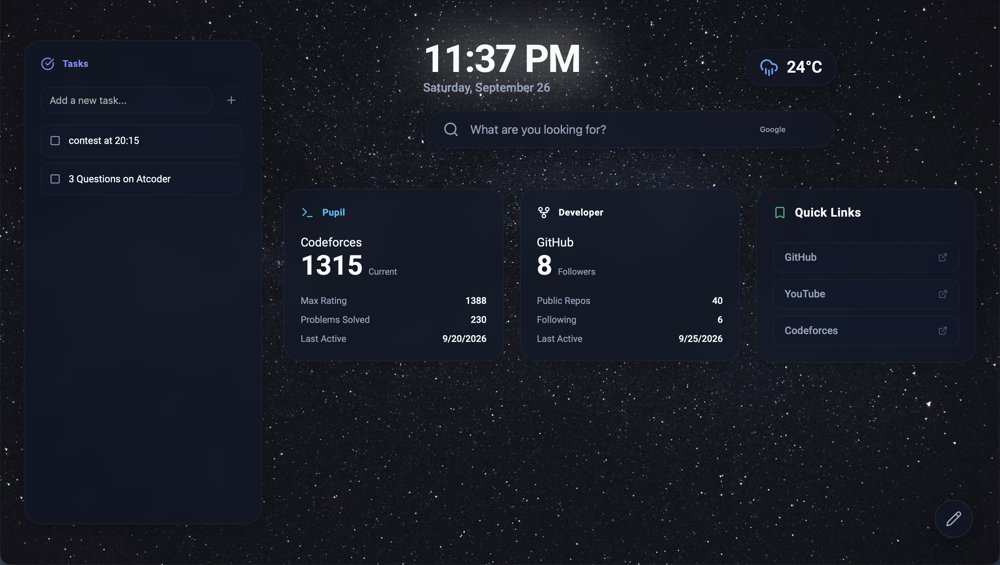

# My very own New Tab Page
- built for a mission in Stardance, Hackclub
- but i have built such that it can compliment my daily coding journey (Competitive Programming, Web Development, and more)

https://new-tab-page-eta-gilt.vercel.app

## My take
- i have kept it simple, nothing like neon colors, and also minimal animations, because ater sometimes animations in productivity apps are nothing but disturbances
- i fetched data from codeforces, github and a weather api
- created a mini TODO app, designed UX such that it is actually usable and not just for show

## Featuress

- See your github stats and codeforces stats
- See the weather of your location
- See your TODOs and add new ones
- set the bg to any image you want, simply paste the link to any image on just found on google
- You can also change the background's color and also the linear gradient
- 

## Tech Stack
- React with Typecript
- Lucide-React for icons
- Public APIs of codeforces and github

# How to run locally
- clone the repo
- run `npm install` to install dependencies
- run `npm run dev` to start the development server
- make sure to have nodejs installed in your system
- and be in root directory of the project when running the above commands
- visit `http://localhost:5173`  to see the website

# Credids
- open-meteo → for weather data
- codeforces -> for competitive programming data
- github -> for github data

## AI Usage
- used to generate theme colors and do a mass find and replace in css files where i needed to repalce the hardcoded values of colors with their equivalent css variables
- used help of gemini with css in things where i was stuck or needed design realted help
